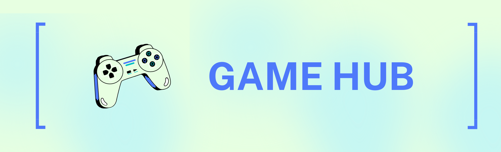

    
    
    
    
    

 
    A gaming hub that can be played on any terminal and any OS. This repository was made for school project. 

## 🛠️ Tools 

## 👾 Games List
- ✅ Math Game
- ✅ Trivia Game
- ✅ Rock Paper Scissors
- ✅ Word Guessing Game
- ✅ Sudoku

## ⚡ How to play the game

Open your desired terminal
    
    cd <folder>

To download the game:

    git clone https://github.com/AbbeyIT/game-hub.git
    
To navigate the game:

    cd game-hub
    
To play the game:

    python main.py

## ✨ Contributors 

Thanks go to these wonderful team:

<table>
  <tbody>
    <tr>
      <td align="center"><a href="https://github.com/BlazenAkali"> <b>Jhos Judiel Cuenca</b></a> <a href="" title="Math game">🔢</a></td>
      <td align="center"><a href="https://github.com/jennymarinay"> <b>Jenny Marinay</b></a> <a href="" title="Trivia Game">🧠</a></td>
      <td align="center"><a href="https://github.com/janicanaldo"> <b>Janica Naldo</b></a> <a href="" title="Rock Paper Scissors">🪨📄✂</a></td>
      <td align="center"><a href="https://github.com/kylieorga"> <b>Christine Kylie Oroga</b></a> <a href="" title="Word Guessing Game">🔠❓</a></td>
      <td align="center"><a href="https://github.com/AbbeyIT"> <b>Abbey Santos</b></a> <a href="" title="Sudoku">📄🔢🇯🇵</a></td>
  </tbody>
</table>

## 🤩 Support

💙 If you like this project, give it a ⭐ and share it with your friends!
